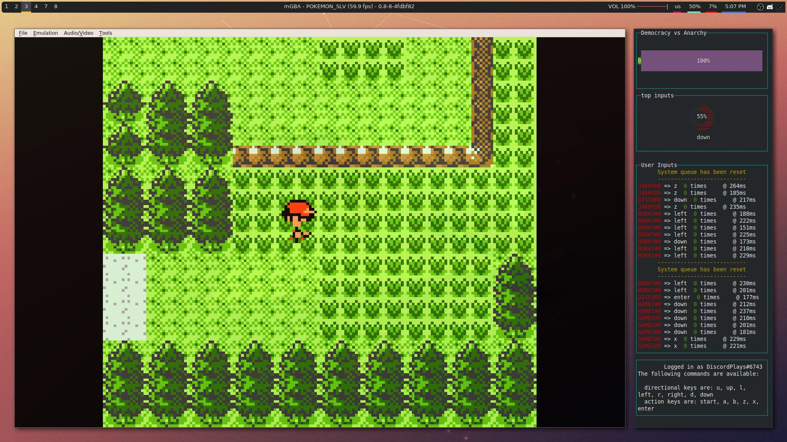

# DiscordPlays

Inspired by TwitchPlays, DiscordPlays simulates keyboard inputs and events. DiscordPlays attempts to emulate "crowdplay" by parsing commands sent by users through Discord's Chat API. The commands are parsed by a bot within the chat, that is also responsible for relaying the commands into the game.

The original TwitchPlays bot simply parsed the commands and relayed it into an external tool such as `xdotool` however, DiscordPlays relays parsed commands natively, in addition the TwitchPlays bot was divided into two separate programs, one designed in python to relay the commands, the other in JavaScript, DiscordPlays is written 100% in JavaScript using Node.js.


## New User Interface

DiscordPlays has been enhanced with a new user interface that displays more verbose information about the game being played, such as the top input, support for system mode updates, and more coherent log functionality, if you prefer the traditional stdout functionality (allows piping output to log file or another program) then you can grab a previous commit before the _ui_ update branch.



## How to Install

Installation is fairly easy, and has been tested on Linux and Windows (currently due to the way MacOS Catalina handles keyboard events, emulators that support simulated keyboard events are fairly limited, so while it does work on Mac, Catalina users will have to find an emulator that supports these events, this is due to the _input monitoring_ permission).

All you need is [Node.js](https://nodejs.org/en/download/) installed, git is optional.

```
git https://github.com/edgar-montano/discordplays.git
cd discordplays
npm install
npm start
```

## Setup

Setting up the bot is fairly easy. You need to first acquire a Discord API Bot token, invite the bot to the desired Discord Server, and than pass it through the configuration file.

You can visit [https://www.writebots.com/discord-bot-token/](https://www.writebots.com/discord-bot-token/) to learn how to acquire a bot token.
_NOTE: The only permissions required for your bot is to Send Messages and to Read Message History, no other permissions are required_

After acquiring your Bot token, you have to create a `.env` file in the root of this project. Inside the `.env` file should be `TOKEN=YOUR_TOKEN_ID`. Alternatively when starting the program you can pass in your Token via command line as an argument.

### Optional Setup

In the `.env` configuration file, there are two other options. First option is to enable debug mode by setting `DEBUG=true`, the second option is to set a text channel to display the usage and valid inputs to the players. You can set the channel in which the bot will send the message by setting `CHANNEL=YOUR_TEXT_CHANNEL_ID`. Both of these items are optionals and do not have to present in the `.env` file for the bot to work.

## Usage

Before running your bot with `npm start` you have to configure the `inputs.json` file located in `data/inputs.json`. The current `inputs.json` file is configured to work with GBA/GBC/GB emulators right out the box, namely it runs well on _Visual Boy Advance_ and _mGBA_ along with _RetroArch_.

The `inputs.json` file format is fairly easy, the `key`, or left hand side represents the command the user can type, and the right hand side, the `value` is the keyboard event that will be simulated.

An example would be as follows:

```
    "key":"value"
{
    "go_up":"up",
    "a":"a",
    "start":"enter
}
```

Currently `inputs.json` is divided into four separate categories to make inputs easier to manage and for some future advance features.

### priorityKeys

The first category is `priorityKeys`, these keys are Case-Sensitive keys, and are computed before the other keys, hence they are given priority over other commands. The reason for this is to overload key inputs with capitals, since all other keys are converted to lowercase. `priorityKeys` can thereby be set to traditional gaming keys such as WASD.

```
"priorityKeys": {
    "W":"up",
    "A":"left",
    "S":"down",
    "D":"right"
},
```

In the recent build `priorityKeys` default values have been removed to enhance the mobile experience, since most phones automatically capitalize the first word.

### directionalKeys

The second category is `directionalKeys` which is fairly straight forward, they represent the possible directions the user can input. Unfortunately `directionalkeys` do not support complex directions such as diagonal movement, this however can be achieved using `functionalKeys` discussed later on. `directionalKeys` are meant to only simulate the d-pad on a controller.

### actionKeys

The third category is `actionKeys` which represent any action the user can take in-game. Such as pressing the `a` or `b` button on a GBA.

### functionalKeys

The final category is `functionalKeys` which represent complex actions that require more than one input from a user. `functionalKeys` were intended to only be used for advance emulator functionality such as "quick save" however can be overloaded to far more complex movements, like simulating an analogue stick or doing a diagonal direction.

`functionalKeys` do not take a single _value_ but rather an array of values, where the first value is the desired input that would be held for the duration, while the subsequent values are the buttons that would be tapped. An example of this is the quick-save functionality in mGBA which requires the input `shift+f1`. To emulate complex movement in a gamee you can follow the format below.

```
{
    "save": ["shift", "f1"],
    "upright": ["up","right"],
    "sonicboom":["left","right","a"]
}
```
